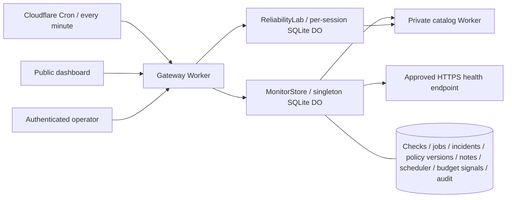

# EdgeLab

[**Live operations dashboard**](https://edgelab-reliability.edgelab-henrywashuhe.workers.dev) · [CI](https://github.com/HenryWashuHe/edgelab/actions) · [Operator runbook](docs/OPERATIONS.md) · [API contract](docs/openapi.yaml)

**A self-hostable reliability workspace on Cloudflare.** Monitor services continuously, investigate durable incidents, measure good-check objectives and coverage, and reproduce resilience failures in an isolated engineering lab.

The operating system comprises a public gateway, a private catalog Worker, and two SQLite-backed Durable Object classes. A Cron Trigger drives monitoring independently of browsers. The public dashboard exposes observations; authenticated operators manage policies, maintenance, acknowledgements, and private investigation notes.

The included deployment monitors its actual public gateway and private catalog service. It starts with an empty incident history and accumulates real checks over time. The catalog contains controlled example data. This is an independently built engineering project, not a claim of production customers or global uptime measurement.

## What is implemented

- **Continuous checks:** one observation opportunity per current UTC minute per deployment-approved target; HTTP status, bounded JSON contract validation, latency objective, timeout, and 16 KB body limit. Redirects are not followed. Delayed schedules are skipped rather than backfilled.
- **Durable incident response:** consecutive-failure opening, consecutive-success recovery, acknowledgement, private investigation notes, and audit events. Incident detail pages expose paginated check evidence, lifecycle timestamps, and the policy versions applicable to each page. Maintenance suspends probes while preserving incidents.
- **Reliable scheduling:** atomic persisted leases, per-service/minute uniqueness, retry deduplication, crash recovery, and policy revision fencing. Observations retain their actual probe start time; a completion may cross a minute boundary without becoming a new sample.
- **Monitoring readiness:** a separate readiness endpoint checks persisted scheduler completion and active-service freshness against a three-minute limit. Dashboard reads cannot renew that evidence. Recent scheduler diagnostics explain starts, completions, and skipped late events.
- **Honest SLO reporting:** verified good-check ratio, p95, error-budget consumption, maintenance exclusion, missing-sample coverage, and legacy unverified counts. Missing data is unknown. Current incomplete minutes and legacy checks without an observation start timestamp receive no verified SLO credit.
- **Paired-window budget signals:** scheduled evaluation of rapid, sustained, and gradual sampled-check burn. Each rule exposes both windows, verified coverage, policy maturity, and its reason. Persisted firing evidence and captured policy context survive missing observations, stale scheduling, maintenance, policy changes, and source-history pruning; older missing context remains explicit.
- **Operator access:** a deployment secret gates writes and audit access. The browser stores the token only in memory. Same-origin checks, bounded payloads, optimistic writes, and deploy-time target enrollment define the boundary.
- **Engineering lab:** isolated per-session token buckets, circuit breakers, actual cached payloads, timeout experiments, traces, CSV/JSON export, and cancellable guided runs.
- **Evidence:** deterministic unit tests, real workerd/SQLite fault tests, local and live HTTP verification, and repeatable concurrency benchmarks with raw results.

## Quick start

Node.js 22.12+ and npm are required.

```sh
npm ci
npm run operator:setup -- --local
npm run dev
```

Open http://localhost:8787. The local operator token is in the ignored `.dev.vars` file. Open it privately to unlock the Operator tab; do not commit it or include it in a screenshot.

Wrangler runs both Workers and both Durable Object classes locally. For an explicit local scheduled event, start with `npm run dev:workers -- --test-scheduled` (after `npm run build`), then:

```sh
curl 'http://localhost:8787/cdn-cgi/local/scheduled?cron=*+*+*+*+*'
```

Local Wrangler does not automatically simulate the production cron. The included HTTPS monitor points at the public deployment; edit `MONITOR_TARGETS` for your own deployment. The private catalog monitor uses the local binding. Tests use isolated fixtures without depending on public services.

Frontend edits require `npm run build` followed by refresh. Worker code reloads automatically. Do not run multiple dev servers against the same persistence directory; use `--persist-to /tmp/edgelab-isolated` for another checkout.

## Architecture



The monitor uses a singleton because this deployment intentionally supports at most five targets. Each current-minute check claims a 30-second durable lease, performs bounded network work outside the transaction, and commits an observation plus its incident transition atomically. A policy revision and lease token fence stale completion. No scheduler HTTP endpoint is publicly exposed. `GET /api/ready` observes monitoring freshness without initiating a probe.

See [architecture decisions](docs/adr/001-monitor-coordination.md), [measurement methodology](docs/MEASUREMENT.md), and [security boundaries](docs/SECURITY.md). The [lab walkthrough](docs/ENGINEERING.md) explains the gateway algorithms in depth.

## Deploy

```sh
npx wrangler login
npx wrangler whoami
# Edit Worker names, service binding, and MONITOR_TARGETS for your account first.
npm run deploy
npm run operator:setup
```

Deploy creates the private origin first, then the gateway and additive SQLite migrations. The second command provisions a random operator secret via Wrangler stdin and saves a mode-600, Git-ignored local copy in `.env.operator`. Rerunning preserves the token; add `--rotate` to revoke the previous one.

The cron is `* * * * *` in UTC. [Cloudflare documents](https://developers.cloudflare.com/workers/configuration/cron-triggers/) trigger changes taking up to 15 minutes to propagate. This is separate from a delayed invocation: EdgeLab accepts only the current scheduled minute and skips older ones. Verify `/api/ops/status` contains fresh observations in at least two distinct scheduled minutes and `/api/ready` returns 200. The runbook covers verification, stopping probes, target changes, troubleshooting, secret rotation, rollback, and retention.

No paid feature is required by the code. Usage depends on targets, probes, public reads, and lab traffic. Limits are finite and account-wide; inspect [Workers limits](https://developers.cloudflare.com/workers/platform/limits/) and [Durable Objects pricing](https://developers.cloudflare.com/durable-objects/platform/pricing/). For restricted deployments, put Cloudflare Access in front of the gateway. The intentionally public lab is not a perimeter abuse control.

## Verify and reproduce

```sh
npm run check             # formatting, unit tests, TS/build, both deployment dry-runs
npm run test:lifecycle    # actual lab eviction, expiry alarms, late completion fencing
npm run test:monitor      # actual monitor auth, incidents, concurrency, leases, retention
npm run test:incident     # incident evidence, private notes, pagination, idempotency
npm run test:upgrade      # migration and observation timing
npm run test:budget       # persisted budget signals, eviction, gaps, revision changes
# With the local server running:
npm run test:integration  # lab HTTP behavior and isolation
BASE_URL=http://localhost:8787 npm run benchmark
```

CI runs the verification scripts on every push and PR, then starts both Workers and runs HTTP integration tests. Monitor tests use real SQLite/workerd and controlled service failures. They also invoke the actual scheduled handler. Synthetic timelines test paired-window signal thresholds and sampling gates; the budget runtime suite verifies durable evidence and read-only aging. The benchmark supports `ROUNDS=1..10`, tests 1/12/24/48 concurrent requests against a fresh lab per trial, and writes results under [docs/evidence](docs/evidence).

[Benchmark methodology](docs/MEASUREMENT.md) distinguishes controlled burst admission from sustained throughput. Results are measurements of a specified environment, not Cloudflare-scale performance claims.

## Operator CLI

```sh
BASE_URL=https://YOUR-WORKER.workers.dev npm run operator -- audit
BASE_URL=https://YOUR-WORKER.workers.dev npm run operator -- pause catalog
BASE_URL=https://YOUR-WORKER.workers.dev npm run operator -- resume catalog
BASE_URL=https://YOUR-WORKER.workers.dev npm run operator -- ack INCIDENT_ID 'Investigating upstream failures'
```

Remote commands read the ignored `.env.operator`; local commands read `.dev.vars`. An explicit `OPERATOR_TOKEN` environment variable can override the file for CI. Credentials are never placed in a URL.

## Incident evidence API

`GET /api/ops/incidents/<id>?before=<slot>` returns up to 50 checks in descending slot order, lifecycle timestamps, and policy versions used by that page. Follow `nextCursor` with the next `before` value. Public responses omit private notes and target URLs. A valid bearer token adds investigation notes and the original acknowledgement note; an invalid supplied token returns 401.

`POST /api/ops/incident-note` accepts `{ "incident": "...", "requestId": "UUID-v4", "note": "..." }` with an operator bearer token. Notes contain 1–500 characters with non-whitespace content, and each incident has a maximum of 100 retained notes. Reuse the same request ID and exact payload after a lost response: the retry returns the existing note. Reusing an ID for a different payload returns 409. Notes can be added after recovery.

The dashboard retains an uncertain note's ID and exact body in authenticated Operations memory across investigation close/reopen. Lock, credential changes, leaving Operations, or reload clear this session-only state. A successful operator write remains confirmed even if the following audit/status refresh fails; read failures are reported separately.

Version 3.2.1 retains export `schemaVersion: 4`, including per-service `budget` and additive nullable `lastFiring.policyContext`. Newly captured policy versions have `recorded` provenance. Migration can recover only the policy currently persisted by v3, marked `recovered-current`; it cannot recreate earlier historical policies. Legacy checks remain available as evidence with `observedAt: null` and are excluded from verified metrics. See the [measurement rules](docs/MEASUREMENT.md) for interpretation.

## Interpreting budget signals

The coordinator evaluates finished-minute history after scheduled probes complete. `service.budget` contains the persisted `evaluation`, its `evaluationStatus`, and retained `lastFiring` evidence. An evaluation is current only for the same policy revision and at most 180 seconds after computation. Dashboard reads age that evidence; they never recompute it.

The browser keeps aging the displayed evaluation after a failed refresh. Stale displayed evidence cannot prove that monitoring stopped or that a warning cleared. Retained warning details use their captured policy version to show the target, latency objective, timeout, contract, transport, service name, recorded time, and provenance; they never borrow current settings to explain an older warning. Missing legacy context remains unavailable. A later confirmed firing can capture a matching version, without proving that metadata was captured at the initial firing.

Rule version 1 uses 60/5-minute windows at 14.4×, 360/30 at 6×, and 4,320/360 at 1×, following the [Google SRE Workbook's 30-day-budget examples](https://sre.google/workbook/alerting-on-slos/). EdgeLab adds its own conservative sampling gates: full current-policy windows, at least 95% verified coverage, 20 non-maintenance observations in the long window, and five in the short window. Both windows must reach the threshold. Rapid firing takes priority over sustained, then gradual; a qualified rapid warning remains visible while longer rules await mature history.

These are coarse probe signals. At a 99.9% target, one bad check among 60 produces about 16.7× burn and can trigger the rapid warning when both windows qualify. Missing evidence cannot prove clearance. The interface distinguishes a previous warning below its trigger from a stale result or warning retained under an earlier policy. Pausing monitoring does not recover an incident. Signals appear in the application; they do not send external notifications or establish customer-request uptime. The [measurement methodology](docs/MEASUREMENT.md) and [signal decision](docs/adr/003-sampled-budget-signals.md) explain the boundaries.

## Project map

| Area                                           | Files                                             |
| ---------------------------------------------- | ------------------------------------------------- |
| Monitoring state machine and validation        | `worker/monitor-domain.ts`                        |
| Timing and monitoring freshness                | `worker/monitor-readiness.ts`                     |
| Incident evidence and private notes            | `worker/incident-evidence.ts`                     |
| Paired-window evaluation and persisted signals | `worker/burn-rate.ts`, `worker/budget-signals.ts` |
| Bounded probes                                 | `worker/monitor-probe.ts`                         |
| SQLite coordinator and operator authentication | `worker/monitor.ts`                               |
| Gateway, cron handler, laboratory coordinator  | `worker/index.ts`                                 |
| Resilience algorithms and origin service       | `worker/engine.ts`, `worker/origin*.ts`           |
| Operations UI                                  | `src/Operations.tsx`, `src/operations.css`        |
| Interactive lab and guides                     | `src/main.tsx`, `src/Guide.tsx`, `src/reports.ts` |
| Runtime tests and benchmarks                   | `scripts/`, `tests/`                              |
| Deployment and CI                              | `wrangler*.jsonc`, `.github/workflows/ci.yml`     |

## Scope and limits

This is a single-owner, small-service operations application with a deliberately bounded deployment model. It does not provide tenant billing, global independent probes, or external email/PagerDuty delivery. Incident notifications live in the dashboard. Monitoring shares the provider being monitored; an independent external monitor can inspect `/api/ready`. Readiness describes observation freshness, so fresh checks reporting upstream failure can still produce healthy monitoring readiness.

Public incident lists include every open incident for active targets and the latest 100 resolved incidents for those targets. Open incidents and current policies persist. Checks, resolved incidents, audit events, scheduler diagnostics, and appended private notes have 30-day retention. Original acknowledgement notes follow their incident record's retention. Exports are bounded reports; collect them periodically if longer history is required.

Each configured service retains one latest budget evaluation and one last firing record, including through a prolonged monitoring gap. Its captured policy metadata remains interpretable after 30-day checks and unreferenced source versions expire. Older warnings without context stay explicit. This is bounded diagnostic evidence, not a complete warning-event history. Removed services' old signal records are pruned after 30 days. A changed policy restarts window maturity; a new deployment cannot immediately claim three days of verified current-policy history.

## How to present the project

> Built a Cloudflare reliability workspace with scheduled monitoring and SQLite-backed Durable Object coordination; implemented durable incident investigations, paired-window error-budget evidence, retry-safe private notes, monitor readiness, and coverage-qualified reporting.

Be ready to explain why unknown observations cannot become uptime, why a lease needs a fencing token, why acknowledgement differs from recovery, and why one coordinator's sampled network path cannot prove global availability. Link the running dashboard, raw benchmark evidence, and CI. Add performance numbers only with their actual test conditions.

Resume claims should describe implemented behavior:

- Coordinated scheduled probes with persisted leases, minute-level deduplication, policy revision fencing, and rejection of historical backfill.
- Preserved incident lifecycle and investigation evidence across eviction, with authenticated idempotent note writes and explicit migration provenance.
- Implemented versioned paired-window burn evaluation with coverage and policy-maturity gates, self-contained warning metadata, and retained evidence across monitoring gaps and source-history pruning.
- Verified failure recovery, threshold boundaries, observation timing, authorization, and durable signal behavior through synthetic timelines and actual-runtime tests.
