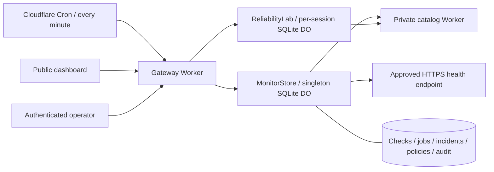

# EdgeLab

[**Live operations dashboard**](https://edgelab-reliability.edgelab-henrywashuhe.workers.dev) · [CI](https://github.com/HenryWashuHe/edgelab/actions) · [Operator runbook](docs/OPERATIONS.md) · [API contract](docs/openapi.yaml)

**A self-hostable reliability workspace on Cloudflare.** Monitor services continuously, investigate durable incidents, measure good-check objectives and coverage, and reproduce resilience failures in an isolated engineering lab.

The operating system comprises a public gateway, a private catalog Worker, and two SQLite-backed Durable Object classes. A Cron Trigger drives monitoring independently of browsers. The public dashboard exposes observations; authenticated operators manage policies, maintenance, acknowledgements, and private investigation notes.

The included deployment monitors its actual public gateway and private catalog service. It starts with an empty incident history and accumulates real checks over time. The catalog contains controlled example data. This is an independently built engineering project, not a claim of production customers or global uptime measurement.

## What is implemented

- **Continuous checks:** one scheduled observation per minute per deployment-approved target; HTTP status, bounded JSON contract validation, latency objective, timeout, and 16 KB body limit. Redirects are not followed.
- **Durable incident response:** consecutive-failure opening, consecutive-success recovery, operator acknowledgement, private notes, and audit events. Maintenance suspends probes while preserving incidents.
- **Reliable scheduling:** atomic persisted leases, per-service/minute uniqueness, retry deduplication, crash recovery, and policy revision fencing. Late or duplicate observations cannot advance incident streaks twice.
- **Honest SLO reporting:** observed good-check ratio, p95, error-budget consumption, maintenance exclusion, and missing-sample coverage. Missing data is unknown. Current incomplete minutes are excluded. Every observation retains its policy revision.
- **Operator access:** a deployment secret gates writes and audit access. The browser stores the token only in memory. Same-origin checks, bounded payloads, optimistic writes, and deploy-time target enrollment define the boundary.
- **Engineering lab:** isolated per-session token buckets, circuit breakers, actual cached payloads, timeout experiments, traces, CSV/JSON export, and cancellable guided runs.
- **Evidence:** deterministic unit tests, real workerd/SQLite fault tests, local and live HTTP verification, and repeatable concurrency benchmarks with raw results.

## Quick start

Node.js 22.12+ and npm are required.

```sh
npm ci
npm run operator:setup -- --local
npm run dev
```

Open http://localhost:8787. The local operator token is in the ignored `.dev.vars` file. Open it privately to unlock the Operator tab; do not commit it or include it in a screenshot.

Wrangler runs both Workers and both Durable Object classes locally. For an explicit local scheduled event, start with `npm run dev:workers -- --test-scheduled` (after `npm run build`), then:

```sh
curl 'http://localhost:8787/cdn-cgi/local/scheduled?cron=*+*+*+*+*'
```

Local Wrangler does not automatically simulate the production cron. The included HTTPS monitor points at the public deployment; edit `MONITOR_TARGETS` for your own deployment. The private catalog monitor uses the local binding. Tests use isolated fixtures without depending on public services.

Frontend edits require `npm run build` followed by refresh. Worker code reloads automatically. Do not run multiple dev servers against the same persistence directory; use `--persist-to /tmp/edgelab-isolated` for another checkout.

## Architecture



The monitor uses a singleton because this deployment intentionally supports at most five targets. Each check claims a 30-second durable lease, performs bounded network work outside the transaction, and commits an observation plus its incident transition atomically. A policy revision and lease token fence stale completion. No scheduler HTTP endpoint is publicly exposed.

See [architecture decisions](docs/adr/001-monitor-coordination.md), [measurement methodology](docs/MEASUREMENT.md), and [security boundaries](docs/SECURITY.md). The [lab walkthrough](docs/ENGINEERING.md) explains the gateway algorithms in depth.

## Deploy

```sh
npx wrangler login
npx wrangler whoami
# Edit Worker names, service binding, and MONITOR_TARGETS for your account first.
npm run deploy
npm run operator:setup
```

Deploy creates the private origin first, then the gateway and additive SQLite migrations. The second command provisions a random operator secret via Wrangler stdin and saves a mode-600, Git-ignored local copy in `.env.operator`. Rerunning preserves the token; add `--rotate` to revoke the previous one.

The cron is `* * * * *` in UTC. New trigger propagation can take up to 15 minutes. Verify `/api/ops/status` contains fresh observations in at least two distinct scheduled minutes. **Do not mistake an HTTP 200 health endpoint for functioning monitoring.** The runbook covers verification, stopping probes, target changes, troubleshooting, secret rotation, rollback, and retention.

No paid feature is required by the code. Usage depends on targets, probes, public reads, and lab traffic. Limits are finite and account-wide; inspect [Workers limits](https://developers.cloudflare.com/workers/platform/limits/) and [Durable Objects pricing](https://developers.cloudflare.com/durable-objects/platform/pricing/). For restricted deployments, put Cloudflare Access in front of the gateway. The intentionally public lab is not a perimeter abuse control.

## Verify and reproduce

```sh
npm run check             # formatting, unit tests, TS/build, both deployment dry-runs
npm run test:lifecycle    # actual lab eviction, expiry alarms, late completion fencing
npm run test:monitor      # actual monitor auth, incidents, concurrency, leases, retention
# With the local server running:
npm run test:integration  # lab HTTP behavior and isolation
BASE_URL=http://localhost:8787 npm run benchmark
```

CI runs the first four checks on every push and PR, then starts both Workers and runs HTTP integration tests. Monitor tests use real SQLite/workerd and controlled service failures. They also invoke the actual scheduled handler. The benchmark supports `ROUNDS=1..10`, tests 1/12/24/48 concurrent requests against a fresh lab per trial, and writes results under [docs/evidence](docs/evidence).

[Benchmark methodology](docs/MEASUREMENT.md) distinguishes controlled burst admission from sustained throughput. Results are measurements of a specified environment, not Cloudflare-scale performance claims.

## Operator CLI

```sh
BASE_URL=https://YOUR-WORKER.workers.dev npm run operator -- audit
BASE_URL=https://YOUR-WORKER.workers.dev npm run operator -- pause catalog
BASE_URL=https://YOUR-WORKER.workers.dev npm run operator -- resume catalog
BASE_URL=https://YOUR-WORKER.workers.dev npm run operator -- ack INCIDENT_ID 'Investigating upstream failures'
```

Remote commands read the ignored `.env.operator`; local commands read `.dev.vars`. An explicit `OPERATOR_TOKEN` environment variable can override the file for CI. Credentials are never placed in a URL.

## Project map

| Area                                           | Files                                             |
| ---------------------------------------------- | ------------------------------------------------- |
| Monitoring state machine and validation        | `worker/monitor-domain.ts`                        |
| Bounded probes                                 | `worker/monitor-probe.ts`                         |
| SQLite coordinator and operator authentication | `worker/monitor.ts`                               |
| Gateway, cron handler, laboratory coordinator  | `worker/index.ts`                                 |
| Resilience algorithms and origin service       | `worker/engine.ts`, `worker/origin*.ts`           |
| Operations UI                                  | `src/Operations.tsx`, `src/operations.css`        |
| Interactive lab and guides                     | `src/main.tsx`, `src/Guide.tsx`, `src/reports.ts` |
| Runtime tests and benchmarks                   | `scripts/`, `tests/`                              |
| Deployment and CI                              | `wrangler*.jsonc`, `.github/workflows/ci.yml`     |

## How to present the project

> Built a Cloudflare reliability workspace with scheduled service monitoring, SQLite-backed Durable Object coordination, durable incident response, and SLO coverage reporting; implemented lease-based job deduplication, revision-fenced policy updates, authenticated operator controls, and reproducible fault/concurrency tests.

Be ready to explain why unknown observations cannot become uptime, why a lease needs a fencing token, why acknowledgement differs from recovery, and why one-region sampled monitoring cannot prove global availability. Link the running dashboard, raw benchmark evidence, and CI. Add performance numbers only with their actual test conditions.

## Scope and limits

This is a single-owner, small-service operations application with a deliberately bounded deployment model. It does not provide tenant billing, global independent probes, or external email/PagerDuty delivery. Incident notifications live in the dashboard. Monitoring shares the provider being monitored; use an independent external monitor for the monitor itself. Open incidents and policies persist; completed checks, resolved incidents, and audit events have 30-day retention. Export summaries periodically if longer history is required.
