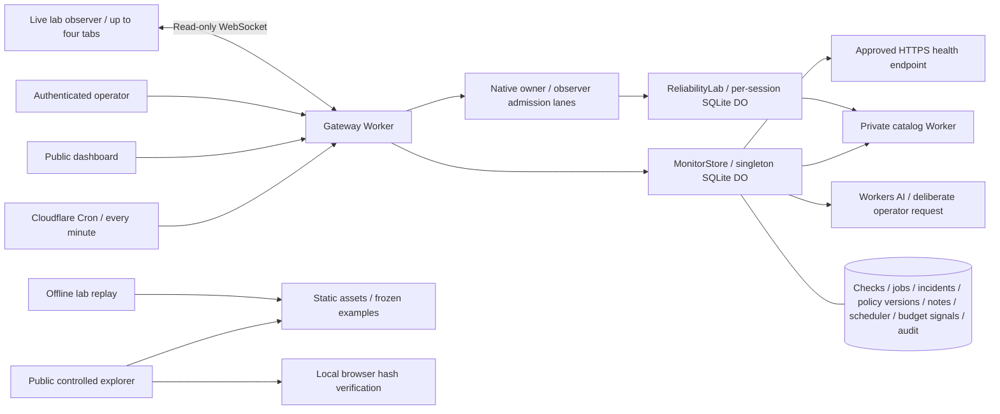

# EdgeLab

Release candidate **3.11.0** loads Operations, observer, replay and the guide when selected. The app shell keeps navigation available during loading or a section failure; manual reload has an explicit in-memory data warning. All built assets, including deferred chunks, now receive byte, MIME and cache-revalidation checks. The [actual build archive](docs/evidence/releases/3.11.0-client-build.json) reproduces the published 3.10.0 baseline and measures 19.58% less gzip JavaScript for Operations and 27.99% less for replay, including shared dependencies. Local check passes 239 unit tests, eight asset-verifier fault tests, TypeScript, build and both deployment dry-runs. Complete CI, deployment and fresh live verification are pending; rendered behavior and load-time improvements remain unverified. See [ADR 012](docs/adr/012-demand-loaded-sections.md).

Deployed **3.10.0** makes the offline coordination recording easier to explore. Operations and Fieldnotes link to replay; loading the pinned built-in example reveals three recorded milestones with separate comparison frames. Its producer remains historical 3.6.0, and uploaded files stay generic even with identical bytes. Thirteen pure tests verify these boundaries. A bounded [actual-runtime benchmark-helper compatibility record](docs/evidence/releases/3.10.0-benchmark-compatibility.json) joins CI. The [full CI](https://github.com/HenryWashuHe/edgelab/actions/runs/36807419968) passes 225 unit tests and all runtime regressions. [Live verification](docs/evidence/releases/3.10.0-live-monitoring.json) at October 1, 02:51:58 UTC confirms exact deployed assets, two new autonomous good minutes per service, healthy readiness and privacy/provenance boundaries. Rendered browser behavior and production resource costs remain unverified.

Version **3.9.0** introduced separate native owner/observer admission lanes before any lab Durable Object lookup. The [local runtime proof](docs/evidence/releases/3.9.0-lab-admission.json) passes 12 groups and 19 samples: limited or unavailable lanes perform no lab namespace, SQL, lease, alarm or origin work, while scheduled monitoring remains independent. The frontend waits for every dispatched burst request to settle and distinguishes an unforwarded admission refusal from a committed engine decision. The [full CI](https://github.com/HenryWashuHe/edgelab/actions/runs/36805850482) passes 212 unit tests and all runtime regressions. [Live verification](docs/evidence/releases/3.9.0-live-monitoring.json) at October 1, 02:32:44 UTC confirms byte-identical assets, one empty owner/observer run, two new autonomous good minutes per service, readiness and privacy boundaries. Exact production rate thresholds, rendered browser behavior and production resource cost remain unverified.

[**Live operations dashboard**](https://edgelab-reliability.edgelab-henrywashuhe.workers.dev) · [**Explore controlled incident briefs**](https://edgelab-reliability.edgelab-henrywashuhe.workers.dev/#notes) · [CI](https://github.com/HenryWashuHe/edgelab/actions) · [Operator runbook](docs/OPERATIONS.md) · [API contract](docs/openapi.yaml)

**A self-hostable reliability workspace on Cloudflare.** Monitor services continuously, investigate durable incidents, measure good-check objectives and coverage, and reproduce resilience failures in an isolated engineering lab.

The operating system comprises a public gateway, a private catalog Worker, and two SQLite-backed Durable Object classes. A Cron Trigger drives monitoring independently of browsers. The public dashboard exposes observations; authenticated operators manage policies, maintenance, acknowledgements, and private investigation notes.

The included deployment monitors its actual public gateway and private catalog service. It starts with an empty incident history and accumulates real checks over time. The catalog contains controlled example data. This is an independently built engineering project, not a claim of production customers or global uptime measurement.

The [storage incident case study](docs/CASE_STUDY.md) explains a real quota failure, the measured repair, and evidence-backed resume bullets.

Published 3.6.0 adds bounded observer recording and offline inspection on `#replay`. [Live verification](docs/evidence/releases/3.6.0-live-monitoring.json) on October 1 confirmed two new autonomous good minutes for each monitored service, healthy readiness, current budget evaluations and schemaVersion 4 privacy boundaries after the quota reset. The bundled recording contains 25 frames from an isolated real workerd run, so reviewers can inspect coordination evidence even when live storage is unavailable. See the [recording guide](docs/LAB.md#record-and-inspect-an-observed-interval).

Deployed 3.7.0 adds bounded public status reuse with explicit storage-read and serve times. The [implementation CI](https://github.com/HenryWashuHe/edgelab/actions/runs/36800527533) passes 154 unit tests and the runtime regressions, including the [28-group controlled status-cache proof](docs/evidence/releases/3.7.0-status-cache.json). [Live HTTP verification](docs/evidence/releases/3.7.0-live-monitoring.json) at 2026-10-01 01:39:44 UTC confirms new autonomous observations, healthy readiness, bounded reuse for both windows and authoritative exports. Rendered browser validation and production SQL/CPU/billing measurements are not claimed.

Version 3.8.0 adds an interactive Architecture evidence panel with pinned 3.7.0 measurements, source hashes and native-failure boundaries. Its controls select recorded workloads without API calls. A new [bounded lab workload record](docs/evidence/releases/3.8.0-lab-storm.json) separates origin admission from storage/lease work, including repeated reads, denied traffic, fresh runs and actual eviction. The [full release CI](https://github.com/HenryWashuHe/edgelab/actions/runs/36803822857) passes 162 unit tests and runtime regressions. [Live verification](docs/evidence/releases/3.8.0-live-monitoring.json) at October 1, 02:07:52 UTC confirms byte-identical deployed assets, two new autonomous good minutes per service, healthy readiness and privacy/provenance boundaries. Open [Architecture](https://edgelab-reliability.edgelab-henrywashuhe.workers.dev/#architecture) to inspect the pinned evidence; rendered browser behavior and production cost remain unverified.

## What is implemented

- **Continuous checks:** one observation opportunity per current UTC minute per deployment-approved target; HTTP status, bounded JSON contract validation, latency objective, timeout, and 16 KB body limit. Redirects are not followed. Delayed schedules are skipped rather than backfilled.
- **Durable incident response:** consecutive-failure opening, consecutive-success recovery, acknowledgement, private investigation notes, and audit events. Incident detail pages expose paginated check evidence, lifecycle timestamps, and the policy versions applicable to each page. Maintenance suspends probes while preserving incidents.
- **Reliable scheduling:** atomic persisted leases, per-service/minute uniqueness, retry deduplication, crash recovery, and policy revision fencing. Observations retain their actual probe start time; a completion may cross a minute boundary without becoming a new sample.
- **Monitoring readiness:** a separate readiness endpoint checks persisted scheduler completion and active-service freshness against a three-minute limit. Dashboard reads cannot renew that evidence. Recent scheduler diagnostics explain starts, completions, and skipped late events.
- **Bounded public status reuse:** the existing monitor instance can reuse either reporting window for less than ten seconds within one UTC minute. Responses disclose the original storage read and delivery time; export, readiness and private evidence remain authoritative reads.
- **Committed cleanup receipts:** completed scheduler events record bounded policy-version cleanup counts atomically with source deletion and queue progress. Authenticated audit reads additionally expose orphan-note counts; opening the disclosure makes no request.
- **Honest SLO reporting:** verified good-check ratio, p95, error-budget consumption, maintenance exclusion, missing-sample coverage, and legacy unverified counts. Missing data is unknown. Current incomplete minutes and legacy checks without an observation start timestamp receive no verified SLO credit.
- **Paired-window budget signals:** scheduled evaluation of rapid, sustained, and gradual sampled-check burn. Each rule exposes both windows, verified coverage, policy maturity, and its reason. Persisted firing evidence and captured policy context survive missing observations, stale scheduling, maintenance, policy changes, and source-history pruning; older missing context remains explicit.
- **Operator access:** a deployment secret gates writes and audit access. The browser stores the token only in memory. Same-origin checks, bounded payloads, optimistic writes, and deploy-time target enrollment define the boundary.
- **Evidence-grounded incident briefs:** an operator can request a bounded Workers AI investigation brief when inference is enabled. Frozen observations, policy history, limits and a SHA-256 hash supply deterministic facts; separately labeled AI hypotheses must cite relevant evidence. Durable request IDs prevent automatic redispatch after response loss or interruption.
- **Public evidence explorer:** three pinned controlled scenarios expose frozen facts, citations, policy context and input limits without operator access. Verify a snapshot hash or compare an altered copy locally. Explanations are human-authored canned test responses; interactions make no application API or native AI calls.
- **Engineering lab:** isolated per-session token buckets, circuit breakers, actual cached payloads, timeout experiments, traces, CSV/JSON export, and cancellable guided runs. A second tab observes committed changes through hibernating WebSockets without renewing the run's idle lease.
- **Bounded recording and offline replay:** the observer captures one connection in memory, up to 256 entries and 192 KiB. Stop freezes the valid prefix while live observation continues; Download exports it with a content hash. Offline stepping validates recorded frames without API calls, socket messages, browser persistence or experiment execution.
- **Inspectable runtime measurements:** the Architecture panel compares recorded one-request storage reads with separate 100-request warm batches, preserving request counts, unknown failed-attempt costs and source hashes. It uses a small bundled projection and makes no application API calls.
- **Evidence:** deterministic unit tests, real workerd/SQLite fault tests, local and live HTTP verification, and repeatable concurrency benchmarks with raw results.

## Quick start

Node.js 22.12+ and npm are required.

```sh
npm ci
npm run operator:setup -- --local
npm run dev
```

Open http://localhost:8787. The local operator token is in the ignored `.dev.vars` file. Open it privately to unlock the Operator tab; do not commit it or include it in a screenshot.

Wrangler runs both Workers and both Durable Object classes locally. For an explicit local scheduled event, start with `npm run dev:workers -- --test-scheduled` (after `npm run build`), then:

```sh
curl 'http://localhost:8787/cdn-cgi/local/scheduled?cron=*+*+*+*+*'
```

Local Wrangler does not automatically simulate the production cron. The included HTTPS monitor points at the public deployment; edit `MONITOR_TARGETS` for your own deployment. The private catalog monitor uses the local binding. Tests use isolated fixtures without depending on public services.

The development command uses `wrangler dev --local`, forces AI generation off and explicitly disables the outer lab admission lanes for reproducible origin-policy experiments, so it starts without Cloudflare authentication or a remote AI proxy. Workers AI has no local model simulation; the offline brief evaluator uses explicit canned responses. [Local binding behavior](https://developers.cloudflare.com/workers/local-development/)

Frontend edits require `npm run build` followed by refresh. Worker code reloads automatically. Do not run multiple dev servers against the same persistence directory; use `--persist-to /tmp/edgelab-isolated` for another checkout.

## Architecture



The monitor uses a singleton because this deployment intentionally supports at most five targets. Each current-minute check claims a 30-second durable lease, performs bounded network work outside the transaction, and commits an observation plus its incident transition atomically. A policy revision and lease token fence stale completion. No scheduler HTTP endpoint is publicly exposed. `GET /api/ready` observes monitoring freshness without initiating a probe.

See [architecture decisions](docs/adr/001-monitor-coordination.md), [measurement methodology](docs/MEASUREMENT.md), and [security boundaries](docs/SECURITY.md). The [lab walkthrough](docs/ENGINEERING.md) explains the gateway algorithms in depth.

## Deploy

```sh
npx wrangler login
npx wrangler whoami
# Edit Worker names, service binding, and MONITOR_TARGETS for your account first.
npm run deploy
npm run operator:setup
```

Deploy creates the private origin first, then the gateway and additive SQLite migrations. The second command provisions a random operator secret via Wrangler stdin and saves a mode-600, Git-ignored local copy in `.env.operator`. Rerunning preserves the token; add `--rotate` to revoke the previous one.

The cron is `* * * * *` in UTC. [Cloudflare documents](https://developers.cloudflare.com/workers/configuration/cron-triggers/) trigger changes taking up to 15 minutes to propagate. This is separate from a delayed invocation: EdgeLab accepts only the current scheduled minute and skips older ones. Verify `/api/ops/status` contains fresh observations in at least two distinct scheduled minutes and `/api/ready` returns 200. The runbook covers verification, stopping probes, target changes, troubleshooting, secret rotation, rollback, and retention.

Inference is disabled by default. Deployment declares native Workers RateLimit bindings; verify their availability in your account. Usage depends on targets, probes, public reads, and lab traffic. Limits are finite and account-wide; inspect [Workers limits](https://developers.cloudflare.com/workers/platform/limits/) and [Durable Objects pricing](https://developers.cloudflare.com/durable-objects/platform/pricing/). For restricted deployments, put Cloudflare Access in front of the gateway. The per-run origin bucket is an experiment. Separate location-scoped lab admission reduces object dispatches, but reserves no global or account allowance. See [the admission decision](docs/adr/011-pre-object-lab-admission.md).

## Verify and reproduce

```sh
npm run check             # formatting, unit tests, TS/build, both deployment dry-runs
npm run test:lifecycle    # actual lab eviction, expiry alarms, late completion fencing
npm run test:lab-observer # live sockets, actual hibernation, committed ordering and cost parity
npm run test:lab-recording # real origin/network trace, pending work, reset and hibernation
npm run test:monitor      # actual monitor auth, incidents, concurrency, leases, retention
npm run test:incident     # incident evidence, private notes, pagination, idempotency
npm run test:upgrade      # migration and observation timing
npm run test:budget       # persisted budget signals, eviction, gaps, revision changes
npm run test:brief        # frozen evidence, AI fakes, quotas, retry and deadline fencing
npm run test:brief-evaluate # controlled preparation/validation report and exact offline replay
npm run test:examples     # pinned public projection matches its whitelisted source
npm run test:check-cache  # source parity, mutation repair, eviction and measured SQL reads
npm run test:monitor-unavailable # safe quota failures and authentication precedence
npm run test:retention    # bounded metadata cleanup, reference repair, migration and rollback
npm run test:retention-cost # whole-cron metadata growth, catch-up and source/output parity
npm run test:monitor-cost # whole-cron read/write measurements in isolated SQLite
npm run test:status-cache # bounded public reuse, real SQLite faults and measured warm reads
npm run test:status-evidence # exact projection from the pinned historical artifact
npm run test:lab-storm    # bounded real lab storage/lease/origin work; no remote URL accepted
npm run test:lab-admission # real native admission lanes before lab lookup; no remote URL accepted
npm run test:benchmark-compatibility # strict benchmark helper against actual local gateway/native gate
npm run test:client-build # actual pinned baseline and complete section/output byte graphs
npm run test:assets-unit  # bounded asset verification fault cases (also in npm run check)
npm run test:assets       # complete asset bytes/MIME/cache over the running local Worker
# With the local server running:
npm run test:integration  # lab HTTP behavior and isolation
BASE_URL=http://localhost:8787 npm run benchmark
```

CI runs the verification scripts on every push and PR, then starts both Workers and runs HTTP integration tests. Monitor tests use real SQLite/workerd and controlled service failures. They also invoke the actual scheduled handler. Synthetic timelines test paired-window signal thresholds and sampling gates; the budget runtime suite verifies durable evidence and read-only aging. The origin-policy benchmark requires the local development admission bypass; it aborts without saving a partial report on an outer admission refusal. It supports `ROUNDS=1..10`, tests 1/12/24/48 concurrent requests against a fresh lab per trial, and writes results under [docs/evidence](docs/evidence).

The [3.6.0 CI run](https://github.com/HenryWashuHe/edgelab/actions/runs/36797743493) passes, including 136 unit tests across 13 files, strict recording import, immutable hashing, both size limits, revision gaps and receipt-clock regression. Local keyboard and mobile replay checks make zero application API requests. The actual recording recipe disables AI, remote metadata refresh and telemetry; its [final-source recheck](docs/evidence/releases/3.6.0-recording-recheck.json) confirms package, producer and actual gateway versions agree. Live browser capture/download, browser file import and the new production UI remain unverified; [validation evidence](docs/evidence/VALIDATION.md) separates those limits from the passing unit, runtime and live HTTP checks.

[Benchmark methodology](docs/MEASUREMENT.md) distinguishes controlled burst admission from sustained throughput. Results are measurements of a specified environment, not Cloudflare-scale performance claims.

## Operator CLI

```sh
BASE_URL=https://YOUR-WORKER.workers.dev npm run operator -- audit
BASE_URL=https://YOUR-WORKER.workers.dev npm run operator -- pause catalog
BASE_URL=https://YOUR-WORKER.workers.dev npm run operator -- resume catalog
BASE_URL=https://YOUR-WORKER.workers.dev npm run operator -- ack INCIDENT_ID 'Investigating upstream failures'
```

Remote commands read the ignored `.env.operator`; local commands read `.dev.vars`. An explicit `OPERATOR_TOKEN` environment variable can override the file for CI. Credentials are never placed in a URL.

## Incident evidence API

`GET /api/ops/incidents/<id>?before=<slot>` returns up to 50 checks in descending slot order, lifecycle timestamps, and policy versions used by that page. Follow `nextCursor` with the next `before` value. Public responses omit private notes and target URLs. A valid bearer token adds investigation notes and the original acknowledgement note; an invalid supplied token returns 401.

`POST /api/ops/incident-note` accepts `{ "incident": "...", "requestId": "UUID-v4", "note": "..." }` with an operator bearer token. Notes contain 1–500 characters with non-whitespace content, and each incident has a maximum of 100 retained notes. Reuse the same request ID and exact payload after a lost response: the retry returns the existing note. Reusing an ID for a different payload returns 409. Notes can be added after recovery.

The dashboard retains an uncertain note's ID and exact body in authenticated Operations memory across investigation close/reopen. Lock, credential changes, leaving Operations, or reload clear this session-only state. A successful operator write remains confirmed even if the following audit/status refresh fails; read failures are reported separately.

Version 3.2.1 retains export `schemaVersion: 4`, including per-service `budget` and additive nullable `lastFiring.policyContext`. Newly captured policy versions have `recorded` provenance. Migration can recover only the policy currently persisted by v3, marked `recovered-current`; it cannot recreate earlier historical policies. Legacy checks remain available as evidence with `observedAt: null` and are excluded from verified metrics. See the [measurement rules](docs/MEASUREMENT.md) for interpretation.

## Storage-aware monitoring

Cron and dashboard reads share a persisted projection of at most 10,080 finished minute slots per service. New finished observations append incrementally; SQLite triggers mark changed covered slots for source repair. Eviction retains the projection. Original observations remain authoritative, and a view never creates checks or renews their timestamps. The original SQL metrics and burn evaluator are preserved.

Version 3.7.0 adds a separate disposable instance cache for public `/api/ops/status` views. At most the two canonical `24h` and `7d` windows share a 1 MiB serialized UTF-8 envelope cap, including private budget-age source metadata; this is not a measured JavaScript heap limit. Reuse requires age below 10,000 ms, the same UTC minute and unchanged configuration/mutation context. Oversized views stay complete and uncached. Eviction discards only these memory entries; SQLite and the persisted check projection remain authoritative. [Status reuse decision](docs/adr/010-bounded-public-status-reuse.md)

The additive `read` object contains `source: "storage" | "memory"`, `materializedAt`, `servedAt`, `ageMs` and `maxAgeMs: 10000`. `now` equals `servedAt`; a memory hit preserves the original materialization and all observation, evaluation, scheduler and cleanup timestamps while aging current status against delivery time. The dashboard's native timing disclosure shows UTC read/serve times and reuse age when served; malformed or older missing provenance stays unavailable. HTTP responses remain `no-store`. `/api/ops/export`, `/api/ready`, incident detail, audit and brief routes bypass reuse. A storage failure not yet observed by the monitor can remain hidden during a less-than-ten-second hit; observed monitor failures clear both entries, and a retained success is never an error fallback. Use authoritative readiness/export reads when investigating storage health.

The [final-source isolated runtime fixture](docs/evidence/releases/3.7.0-status-cache.json), measured at 2026-10-01 01:15:44 UTC, used 27 SQL statements/158 rows read for two targets and 63/362 for five on a mature miss or authoritative export, with zero writes, for both windows. Each set of 100 concurrent and 100 sequential warm hits executed zero SQL attempts, rows read/written, KV operations and alarm work. Constructor, enrollment and mature-input bootstrap costs are measured separately. These results establish neither CPU cost, free requests, account capacity nor production savings. The separate [live HTTP check](docs/evidence/releases/3.7.0-live-monitoring.json) verifies reuse provenance and unchanged source observations, without measuring production storage cost.

Storage failures return a sanitized JSON 503, with readiness unavailable and gateway liveness separate. Browser refreshes run once per minute, coalesce duplicate reads, and back off on a known daily quota while cached evidence continues to age. The Free-plan allowance is shared with other account activity. Controlled whole-monitor measurements and their limits are in the verification record; configured maximum targets are not a Free-plan capacity guarantee.

Policy-version and orphan-note cleanup use persisted FIFO work queues, examining at most 32 candidates each per completed cron cleanup. Indexed rechecks preserve every current or check-referenced policy and every note whose parent has returned. Note age expiry and deletion of all notes from expired resolved parents remain eager and atomic; other unused metadata can wait for its queue position. Triggers track source changes and replacement behavior, and an atomic one-time migration queues legacy candidates without deleting their bodies. Reads never drain these queues. See the [retention decision](docs/adr/006-metadata-retention-work.md) for fairness, rollback and workload limits.

Version 3.4.2 reuses the existing completed scheduler write as a cleanup receipt. Each FIFO batch reports examined, directly deleted, protected and already-missing source rows; a full batch of 32 conservatively says more work may remain. Counts exclude eager expiry and cold migration, and legacy or malformed receipts remain unavailable. Public status and exports expose only version counts; private note counts require the audit endpoint. Cached receipts keep their recorded timestamp, and this feature adds no browser polling. The [receipt decision](docs/adr/007-committed-cleanup-diagnostics.md) explains the contract.

The [3.4.2 controlled cost comparison](docs/evidence/releases/3.4.2-retention-cost.json) preserves the [3.4.1 measurements](docs/evidence/releases/3.4.1-retention-cost.json): steady cron remains 94 reads/40 writes for two targets and 189/82 for five, with either small or grown retained metadata. A full 32-version plus 32-note catch-up adds 128 reads, zero writes and zero SQL statements for the counters. These are fixture costs, not total account quota or proof of production recovery.

## Workers AI incident briefs

Open an incident investigation after unlocking Operations to inspect private brief history and, when enabled, generate a new brief. `POST /api/ops/incident-brief` accepts only `{incident, requestId}`. `GET /api/ops/incident-briefs/<requestId>` retrieves that frozen request without inference. The authenticated `GET /api/ops/incidents/<id>/briefs` lists the latest five records, capability and application quota. Briefs never enter public status, exports or incident detail.

Each request freezes up to 50 observations, referenced policies, lifecycle, deterministic counts and explicit evidence limits. A SHA-256 hash identifies the captured snapshot. The bounded prompt selects representative references and reports omissions. The response may contain up to two hypotheses with applicable evidence IDs and allowlisted investigation suggestions. Citations establish relevance to recorded symptoms, not causality. The UI renders model strings as text and never executes suggestions or modifies incident state.

The application permits four inference attempts per UTC day, one start per UTC minute and one pending request, with a 20-second deadline. Failed attempts consume their reservation. A separate admission limit permits 16 new records per UTC day, at most 256 physically retained rows, and 128 KiB per new serialized record with completion headroom reserved. Insufficient-evidence and preparation-failure records consume record admission without consuming an AI attempt. Cleanup never refunds daily counters. While its record is retained, reusing a UUID returns its original state before these admission gates; failures and interrupted requests are terminal. This bounds application dispatch and storage, without claiming exactly-once provider billing. Records expire 30 days after creation. Missing verified failures produce deterministic insufficient evidence, with no AI call. Older records are preserved; a counterless-store upgrade conservatively closes new record creation for its first UTC day because deleted legacy creation history is unknown.

The [offline evaluation walkthrough](docs/BRIEF_EVALUATION.md) exercises actual capture, prompt preparation, decoding and citation validation against three labeled controlled scenarios. It writes a replayable report with snapshot/input hashes, byte counts, supplied references and omissions. Canned acceptance measures neither native model quality nor a proven cause.

The [public explorer](https://edgelab-reliability.edgelab-henrywashuhe.workers.dev/#notes) presents a whitelisted projection of the pinned 3.3.2 report. It includes HTTP errors/recovery, timeouts/coverage gaps, and insufficient verified evidence. Inspecting examples never reads live incidents or private brief APIs. Hash comparison identifies content changes; it cannot prove authenticity or causality. Directly opening Fieldnotes loads static assets independently of monitor storage. [Static asset routing](https://developers.cloudflare.com/workers/static-assets/)

Inference uses the fixed [Llama 3.3 70B model](https://developers.cloudflare.com/workers-ai/models/llama-3.3-70b-instruct-fp8-fast/) through the native AI binding, with 2 KiB message content, 4 KiB serialized input and 512 output tokens. Ordinary tests use fakes. `AI_BRIEFS_ENABLED` defaults to `false`; verify the account's plan and shared [Workers AI allocation](https://developers.cloudflare.com/workers-ai/platform/pricing/) before deliberately enabling it. No billing upgrade is performed by this project. The binding alone does not prove a real model call succeeded. See the [operator runbook](docs/OPERATIONS.md) and release validation for the actual verified capability.

## Interpreting budget signals

The coordinator evaluates finished-minute history after scheduled probes complete. `service.budget` contains the persisted `evaluation`, its `evaluationStatus`, and retained `lastFiring` evidence. An evaluation is current only for the same policy revision and at most 180 seconds after computation. Dashboard reads age that evidence; they never recompute it.

The browser keeps aging the displayed evaluation after a failed refresh. Stale displayed evidence cannot prove that monitoring stopped or that a warning cleared. Retained warning details use their captured policy version to show the target, latency objective, timeout, contract, transport, service name, recorded time, and provenance; they never borrow current settings to explain an older warning. Missing legacy context remains unavailable. A later confirmed firing can capture a matching version, without proving that metadata was captured at the initial firing.

Rule version 1 uses 60/5-minute windows at 14.4×, 360/30 at 6×, and 4,320/360 at 1×, following the [Google SRE Workbook's 30-day-budget examples](https://sre.google/workbook/alerting-on-slos/). EdgeLab adds its own conservative sampling gates: full current-policy windows, at least 95% verified coverage, 20 non-maintenance observations in the long window, and five in the short window. Both windows must reach the threshold. Rapid firing takes priority over sustained, then gradual; a qualified rapid warning remains visible while longer rules await mature history.

These are coarse probe signals. At a 99.9% target, one bad check among 60 produces about 16.7× burn and can trigger the rapid warning when both windows qualify. Missing evidence cannot prove clearance. The interface distinguishes a previous warning below its trigger from a stale result or warning retained under an earlier policy. Pausing monitoring does not recover an incident. Signals appear in the application; they do not send external notifications or establish customer-request uptime. The [measurement methodology](docs/MEASUREMENT.md) and [signal decision](docs/adr/003-sampled-budget-signals.md) explain the boundaries.

## Project map

| Area                                           | Files                                                                    |
| ---------------------------------------------- | ------------------------------------------------------------------------ |
| Monitoring state machine and validation        | `worker/monitor-domain.ts`                                               |
| Timing and monitoring freshness                | `worker/monitor-readiness.ts`                                            |
| Incident evidence and private notes            | `worker/incident-evidence.ts`                                            |
| Retention queues and committed receipt types   | `worker/monitor-version-retention.ts`, `worker/metadata-cleanup.ts`      |
| Paired-window evaluation and persisted signals | `worker/burn-rate.ts`, `worker/budget-signals.ts`                        |
| Bounded probes                                 | `worker/monitor-probe.ts`                                                |
| SQLite coordinator and operator authentication | `worker/monitor.ts`                                                      |
| Gateway, cron handler, laboratory coordinator  | `worker/index.ts`                                                        |
| Resilience algorithms and origin service       | `worker/engine.ts`, `worker/origin*.ts`                                  |
| Operations UI                                  | `src/Operations.tsx`, `src/operations.css`                               |
| Interactive lab and guides                     | `src/main.tsx`, `src/Guide.tsx`, `src/reports.ts`                        |
| Observer recording and offline inspection      | `src/lab-recording.ts`, `src/LabReplay.tsx`, `scripts/lab-recording.mjs` |
| Runtime tests and benchmarks                   | `scripts/`, `tests/`                                                     |
| Deployment and CI                              | `wrangler*.jsonc`, `.github/workflows/ci.yml`                            |

## Scope and limits

This is a single-owner, small-service operations application with a deliberately bounded deployment model. It does not provide tenant billing, global independent probes, or external email/PagerDuty delivery. Incident notifications live in the dashboard. Monitoring shares the provider being monitored; an independent external monitor can inspect `/api/ready`. Readiness describes observation freshness, so fresh checks reporting upstream failure can still produce healthy monitoring readiness.

Public incident lists include every open incident for active targets and the latest 100 resolved incidents for those targets. Open incidents and current policies persist. Checks, resolved incidents, audit events, scheduler diagnostics, and appended private notes have 30-day retention. Original acknowledgement notes follow their incident record's retention. Exports are bounded reports; collect them periodically if longer history is required.

A lab recording preserves an observed interval, not a whole-run backup or a script to rerun commands. The initial snapshot can include earlier outcomes, and revision gaps remain unknown. Server commit/frame times and recorder receipt times use separate clocks; their difference is not measured network latency. A matching SHA-256 detects content changes but cannot authenticate the source. The [controlled recording](src/data/lab-recording-example.json) has content hash `ee884cdcefaedcd23c22eed275ec5088852beec2b6dd8ed323381d2cc908a082`; its [runtime provenance](docs/evidence/releases/3.6.0-recording-runtime.json) is separate from production recovery and native AI evidence.

Each configured service retains one latest budget evaluation and one last firing record, including through a prolonged monitoring gap. Its captured policy metadata remains interpretable after 30-day checks and unreferenced source versions expire. Older warnings without context stay explicit. This is bounded diagnostic evidence, not a complete warning-event history. Removed services' old signal records are pruned after 30 days. A changed policy restarts window maturity; a new deployment cannot immediately claim three days of verified current-policy history.

## How to present the project

> Built a Cloudflare reliability workspace with scheduled monitoring and SQLite-backed Durable Object coordination; implemented durable incident investigations, paired-window error-budget evidence, retry-safe private notes, monitor readiness, and coverage-qualified reporting.

Be ready to explain why unknown observations cannot become uptime, why a lease needs a fencing token, why acknowledgement differs from recovery, and why one coordinator's sampled network path cannot prove global availability. Link the running dashboard, raw benchmark evidence, and CI. Add performance numbers only with their actual test conditions.

Resume claims should describe implemented behavior:

- Coordinated scheduled probes with persisted leases, minute-level deduplication, policy revision fencing, and rejection of historical backfill.
- Preserved incident lifecycle and investigation evidence across eviction, with authenticated idempotent note writes and explicit migration provenance.
- Implemented versioned paired-window burn evaluation with coverage and policy-maturity gates, self-contained warning metadata, and retained evidence across monitoring gaps and source-history pruning.
- Verified failure recovery, threshold boundaries, observation timing, authorization, and durable signal behavior through synthetic timelines and actual-runtime tests.
- Captured real workerd coordination frames through concurrent admission, reset fencing and original-socket hibernation, then validated and inspected the bounded recording offline without executing commands.
