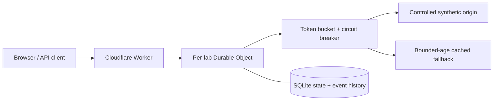

# EdgeLab

[**Open the live demo**](https://edgelab-reliability.edgelab-henrywashuhe.workers.dev) · [CI checks](https://github.com/HenryWashuHe/edgelab/actions)

**Break things. Build resilience.** An interactive API reliability lab built with Cloudflare Workers, SQLite-backed Durable Objects, React, and TypeScript.

Send a concurrent traffic burst, inject an origin outage, and watch a coordinated token bucket, circuit breaker, and cached fallback protect the request path. Every request leaves an inspectable event. Export an experiment as JSON.

This is a working educational gateway with a **synthetic origin**, not a production proxy or a claim of Internet-scale performance. The origin is an actual asynchronous delay with controlled failures inside the Durable Object; it never contacts external targets. Latency is measured server elapsed time, not browser RTT.

## Run locally

Requires Node.js 22.12+ and npm.

```sh
npm ci
npm run dev
```

Open http://localhost:8787 and select **Run guided demo**. Wrangler runs the Worker, SQLite storage, and Durable Objects locally. The local server needs permission to bind loopback ports. No Cloudflare account or API key is needed locally.

`npm run dev` builds the UI before starting Wrangler. Worker changes reload automatically; after frontend edits, run `npm run build` in a second terminal and refresh the browser.

## What to try

1. **Guided demo:** warms the cache, injects failures, opens the circuit, restores the origin, waits for cooldown, and probes recovery. Resets the current lab first.
2. **Traffic burst:** fires 24 concurrent requests against one shared token budget. With a full default bucket, an immediate burst admits 12 and rejects the rest with HTTP 429. Refill and timing can change the exact count.
3. **Failure without fallback:** disable the cache switch, take the origin offline, and send requests. The first failures return 502; once the circuit opens, new admitted traffic returns 503 without origin work.
4. **Steady traffic:** sends one request per second plus response time, stopping after 60 requests or when you press Stop.
5. **Export JSON:** saves configuration, all-run counters, and the most recent 180 events. The displayed table shows the latest 30 matching events and the chart shows 60.

## Architecture



- **Worker:** serves the frontend through Workers Static Assets; validates API path, origin, body size, and session ID.
- **Durable Object:** one coordinator per opaque UUID session. Admission reserves tokens and the sole half-open probe in synchronous SQLite transactions before awaiting origin work. Completion uses another transaction.
- **Circuit breaker:** closed → open after three consecutive failures → one half-open probe after a four-second cooldown → closed on success, open on failure.
- **Generation fencing:** late completions from an older circuit generation cannot change the new circuit. A run ID invalidates requests admitted before reset. A ten-second persisted probe lease recovers interrupted probes.
- **Cache:** last successful response timestamp and a constant synthetic payload. Failures and circuit bypasses may serve it for up to 60 seconds. Rate-limited requests still return 429.
- **Storage:** state and a 180-row event ring survive object eviction. Counters cover the entire run, including admitted requests still in flight. Idle labs currently persist until reset; no expiration alarm is implemented.

See [the engineering walkthrough](docs/ENGINEERING.md) for invariants, limitations, and extension ideas. The app also has Architecture and Field notes views.

## Verify

```sh
npm test                 # deterministic engine tests
npm run build            # strict TypeScript + production frontend bundle
npm run check            # formatting, tests, build, Cloudflare deployment dry-run
```

With `npm run dev` running in another terminal:

```sh
npm run test:integration
```

Integration checks execute real HTTP requests against the local Worker and SQLite-backed Durable Object: concurrent admission, outage/fallback/recovery, isolated sessions, validation, reset fencing, and log retention. They use a new random session, never the browser's session. To test a deployed instance you own, explicitly set `BASE_URL`.

## Deploy to your Cloudflare account

```sh
npx wrangler login
npx wrangler whoami
npm run deploy
```

The deploy creates the `edgelab-reliability` Worker and its SQLite-backed Durable Object namespace. Wrangler prints your workers.dev URL. The repository includes the initial `new_sqlite_classes` migration and needs no manual database provisioning. Choose a different Worker name in `wrangler.jsonc` if that name already belongs to an existing project in your account.

Cloudflare supports SQLite-backed Durable Objects on the Workers Free plan, subject to current account limits. Check [Durable Objects pricing](https://developers.cloudflare.com/durable-objects/platform/pricing/) and [Workers limits](https://developers.cloudflare.com/workers/platform/limits/) before sustained traffic. No paid service is required by the code.

A public anonymous lab can be abused to create sessions and consume your account quota. The lab's adjustable bucket is an experiment, **not** a perimeter abuse control. For broad public access, add a separate admission boundary (such as Cloudflare Access for private demos, or session issuance with abuse controls) and idle-session cleanup. Do not put sensitive data in a lab. Knowing its UUID grants access; there are no user accounts.

## API

All lab endpoints require a UUID v4 `X-Lab-ID` header. Keep it out of public screenshots or URLs if you want your demo session private. Same-origin browser requests and non-browser clients with the capability are accepted. All API responses disable caching.

| Endpoint       | Method | Behavior                                                               |
| -------------- | ------ | ---------------------------------------------------------------------- |
| `/api/health`  | GET    | Worker health and actual edge colo, or `LOCAL`                         |
| `/api/state`   | GET    | State snapshot and latest 180 completed events                         |
| `/api/request` | POST   | Run one protected request; returns 200, 429, 502, or 503               |
| `/api/config`  | POST   | Apply bounded configuration fields                                     |
| `/api/reset`   | POST   | Clear lab history and restore defaults; in-flight old work returns 409 |

```sh
LAB_ID=$(node -e 'console.log(crypto.randomUUID())')
curl -H "X-Lab-ID: $LAB_ID" -X POST http://localhost:8787/api/request
curl -H "X-Lab-ID: $LAB_ID" http://localhost:8787/api/state
```

Numeric bounds: capacity 1–50, refill 1–20 tokens/s, threshold 1–10, cooldown 1–15 seconds, synthetic latency 20–1000 ms. Origin mode is `healthy`, `flaky` (every third origin call fails), or `failing`. Bodies over 4 KB are rejected.

## Project layout

```text
worker/engine.ts          deterministic admission and recovery state machine
worker/index.ts           Worker router, Durable Object, SQLite persistence
src/main.tsx             dashboard, experiments, export, architecture notes
src/style.css            responsive interface
scripts/integration.mjs  HTTP tests against the actual local runtime
tests/engine.test.ts      deterministic edge-case tests
docs/ENGINEERING.md       design decisions and interview preparation
wrangler.jsonc           deployable Cloudflare configuration
```

## Resume wording

> Built an interactive API resilience lab using Cloudflare Workers, SQLite-backed Durable Objects, and TypeScript; implemented coordinated token-bucket rate limiting, circuit breaking with single-probe recovery, and bounded-age cached fallback.

Use this after you can explain and reproduce the behavior. Add numbers only from experiments you ran and saved. Do not claim production traffic, global latency, or performance at Cloudflare's scale based on a localhost demo.

A strong follow-up is to implement one extension yourself, publish an experiment with reproducible steps, and explain a tradeoff or bug you discovered. See [docs/ENGINEERING.md](docs/ENGINEERING.md).

## Platform references

- [Durable Objects overview](https://developers.cloudflare.com/durable-objects/)
- [SQLite storage API](https://developers.cloudflare.com/durable-objects/api/sqlite-storage-api/)
- [Workers Static Assets](https://developers.cloudflare.com/workers/static-assets/)
- [New SQLite namespace migration](https://developers.cloudflare.com/changelog/post/2026-07-09-restrict-new-kv-backed-namespaces/)

The dev tooling pins a patched Undici release through npm overrides to avoid the advisory affecting Wrangler's transitive dependency. The production Worker does not bundle Undici.
