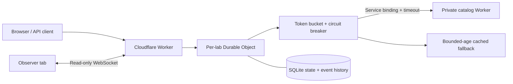

# EdgeLab

[**Open the live demo**](https://edgelab-reliability.edgelab-henrywashuhe.workers.dev) · [CI checks](https://github.com/HenryWashuHe/edgelab/actions)

**Break things. Build resilience.** An interactive API reliability lab built with Cloudflare Workers, SQLite-backed Durable Objects, React, and TypeScript.

Send a concurrent traffic burst, inject an origin outage, and watch a coordinated token bucket, circuit breaker, and cached fallback protect the request path. Every request leaves an inspectable event. Inspect response payloads and request IDs, then export an experiment as JSON or CSV.

The gateway calls a **separate private origin Worker through a service binding**. The catalog data and injected failures are synthetic; the service-to-service requests, response cache, timeout handling, and persistence are real. This is an educational lab, not a general-purpose production proxy or a claim of Internet-scale capacity. Latency is measured server elapsed time, not browser RTT.

Version 2 adds actual cached payloads, configurable timeouts, automatic idle cleanup, a keyboard-accessible request inspector, CSV exports, cancellable guided experiments, and controls that stay available during steady traffic.

Version 3.5 adds a live observer in a second tab. It streams committed token reservations, circuit changes, pending requests and the latest twelve outcomes through the Durable Object's Hibernation WebSocket API. Watching sends no experiment commands and does not renew the run's idle deadline.

Published 3.6.0 adds in-memory observer recording and an offline `#replay` view. Live HTTP verification confirms the deployed version and autonomous monitoring recovery; [validation evidence](evidence/VALIDATION.md) records the separate browser and native-AI limits.

Storage failures return JSON503 with code `lab-storage-unavailable`, a sanitized reason and a known UTC reset time when available. The browser marks current state unconfirmed, pauses experiments, and retains cached logs as historical evidence. Reconnect performs one state read and never repeats an uncertain request, reset or configuration write. With no loaded snapshot, metrics and history remain unknown.

Deployed 3.7.0 reuses only the separate Operations dashboard's public status view, for less than ten seconds in one UTC minute. Its `read` provenance separates storage materialization from serving time, without renewing observations. Export, readiness, private evidence and all laboratory HTTP/WebSocket paths bypass that cache. A previously unobserved monitor-storage failure can be hidden during the short reuse interval; observed monitor failures clear it. See the [operator guidance](OPERATIONS.md#interpret-370-view-timing), [final-source controlled runtime archive](evidence/releases/3.7.0-status-cache.json) and [live HTTP verification](evidence/releases/3.7.0-live-monitoring.json). Rendered browser validation and production SQL/CPU/billing measurements are not claimed. The published 3.6 recording and its 192 KiB limit remain unchanged.

Version 3.8.0 adds recorded runtime measurements to Architecture without application API calls. `npm run test:lab-storm` measures the actual lab request path locally, including state reads and circuit denials that avoid the origin but still perform storage and idle-lease work. The [manifest](evidence/releases/3.8.0-lab-storm.json) separates measured groups, constructors, enrollment, diagnostic reads and eviction. It accepts no remote URL and establishes no production cost or capacity claim.

## Run locally

Requires Node.js 22.12+ and npm.

```sh
npm ci
npm run dev
```

Open http://localhost:8787 and select **Run guided demo**. Wrangler starts both Workers, their service binding, SQLite storage, and Durable Objects locally. The local server needs permission to bind loopback ports. No Cloudflare account or API key is needed locally.

`npm run dev` builds the UI before starting Wrangler. Worker changes reload automatically; after frontend edits, run `npm run build` in a second terminal and refresh the browser.

## What to try

1. **Guided demo:** warms the cache, injects failures, opens the circuit, restores the origin, waits for cooldown, and probes recovery. Resets the current lab first; Stop demo cancels future requests and retains completed events.
2. **Traffic burst:** fires 24 concurrent requests against one shared token budget. With a full default bucket, an immediate burst admits 12 and rejects the rest with HTTP 429. Refill and timing can change the exact count.
3. **Failure without fallback:** disable the cache switch, take the origin offline, and send requests. The first failures return 502; once the circuit opens, new admitted traffic returns 503 without origin work.
4. **Steady traffic:** sends one request per second plus response time. Change origin health, cache policy, or timing while it runs. Stops after 60 requests or when you press Stop.
5. **Slow origin:** expand Timing & recovery settings. Set origin delay above the timeout budget. Without a populated cache, the gateway returns 504 and counts a circuit failure.
6. **Inspect a response:** click a request time. Compare the revision and generatedAt fields of a fresh and cached response. Request IDs, retry hints, cache age, and origin attempts are recorded.
7. **Export JSON / CSV:** JSON includes configuration and all-run counters. CSV includes chronological event rows. Both export the latest 180 events; the table shows 30 matching events and the chart shows 60.
8. **Observe another tab:** select **Open live observer** beside the guided demo. Keep the main lab open and send a burst, change the origin, or reset. The observer shows actual committed token balances without simulating refill. Disconnect preserves clearly cached evidence; reconnect obtains a new snapshot without replaying a command. The tabs must share browser storage. Opening the observer alone cannot create a run.

## Record and inspect an observed interval

The observer starts a recording with its validated initial snapshot and appends accepted frames for that connection in memory. Select **Stop recording**, then **Download recording**. Stop freezes the captured prefix while live observation can continue. Download before reconnecting, leaving the view or reloading; no recording is kept in localStorage, sessionStorage or a server database. Limits are 256 entries and 192 KiB of finalized UTF-8 JSON, with 1 KiB reserved for final metadata. Reaching a limit freezes the valid prefix instead of dropping its first snapshot.

Follow **Inspect recorded coordination** from Operations or Fieldnotes, then select **Load built-in recording**, or choose a previously downloaded file. The bundled 25-frame example comes from the actual local gateway, SQLite Durable Object and private origin Worker. The frames show pending admissions, settled successes, a changed run identity, failure and a recovery attempt. The separate runtime recipe verifies real origin dispatch, reset fencing and original-socket forced hibernation; those assertions cannot be established from the recording alone. Its content hash is `ee884cdcefaedcd23c22eed275ec5088852beec2b6dd8ed323381d2cc908a082`; inspect the [recording](../src/data/lab-recording-example.json) and [separate runtime manifest](evidence/releases/3.6.0-recording-runtime.json). An [independent final-source recheck](evidence/releases/3.6.0-recording-recheck.json) verifies the recipe and version agreement without replacing the pinned example.

Previous/Next and the keyboard-accessible slider inspect recorded entries only. Replay makes no application API requests or WebSocket messages, reads no lab capability, stores nothing in browser persistence and executes no experiment. It has no timed playback or simulated refill. Revision jumps show unobserved commits; missing state and outcomes are never reconstructed. Reset changes the run and clears the earlier run's displayed events. A terminal entry retains the last observed figures as historical evidence.

Server commit time, server frame time and recorder receipt time remain distinct. Receipt-clock regression does not reorder the file, and cross-clock differences cannot measure network delay. A stopped recording says nothing about later activity. The content hash detects changed content; it is unsigned and establishes neither authenticity nor Cloudflare origin. This is an observed interval, not a whole-run backup or deterministic re-execution.

## Architecture



- **Worker:** serves the frontend through Workers Static Assets; validates API path, origin, body size, and session ID.
- **Durable Object:** one coordinator per opaque UUID session. Admission reserves tokens and the sole half-open probe in synchronous SQLite transactions before awaiting origin work. Completion uses another transaction.
- **Circuit breaker:** closed → open after three consecutive failures → one half-open probe after a four-second cooldown → closed on success, open on failure.
- **Generation fencing:** late completions from an older circuit generation cannot change the new circuit. A run ID invalidates requests admitted before reset. A ten-second persisted probe lease recovers interrupted probes.
- **Origin:** a separate Worker returns a versioned catalog response. Its workers.dev and preview routes are disabled; only the service binding is used. The gateway validates its response and applies a configurable timeout, including response-body consumption.
- **Cache:** the actual last successful catalog payload and its capture timestamp. Failures and circuit bypasses may serve it for up to 60 seconds. Rate-limited requests still return 429.
- **Storage:** state and a 180-row event ring survive object eviction. Counters cover the entire run, including admitted requests still in flight. The existing HTTP lab controls, including state refresh, renew a 24-hour idle deadline. Observer attachment and reconnect do not. An alarm deletes SQL, KV, and alarm metadata after inactivity. If owner activity reaches an expired run before a delayed alarm, it starts a new run; late origin completions cannot write into that new run. State created before v2 gains cleanup on its next owner HTTP request.
- **Live observation:** at most four sockets attach to an existing run. A bounded allowlisted snapshot includes the latest twelve outcomes; each update includes at most one new outcome. A revision and actual commit timestamp accompany existing state writes. Legacy runs retain an unknown commit time until a real owner write. Fanout captures each commit once, with no query per observer, heartbeat, polling timer or command replay. See [ADR 008](adr/008-live-lab-observer.md).

See [the engineering walkthrough](ENGINEERING.md) for invariants, limitations, and extension ideas. The app also has Architecture and Field notes views.

## Verify

```sh
npm test                 # deterministic engine tests
npm run build            # strict TypeScript + production frontend bundle
npm run check            # formatting, tests, build, deployment dry-runs
npm run test:lifecycle   # actual eviction, idle alarms, and post-expiry recovery
npm run test:lab-observer # actual sockets, hibernation, ordering, rollback and storage measurements
npm run test:lab-recording # real origin and network recording, strict export/import and provenance
```

With `npm run dev` running in another terminal:

```sh
npm run test:integration
```

The 3.6.0 CI run passes 136 unit tests across 13 files. Recording tests cover strict privacy/shape rejection, malformed imports, hashing, UTF-8 bounds, entry and byte limits, frozen-prefix preservation, terminals, revision gaps and separate receipt clocks. Local keyboard/mobile replay checks make zero application API requests. Live browser capture/download, browser file import and the new production UI remain unverified; see [validation evidence](evidence/VALIDATION.md). Unit and controlled runtime checks do not establish production observation or native AI execution.

Integration checks execute real HTTP requests against both local Workers and the SQLite-backed Durable Object: real payload caching, upstream timeout, concurrent admission, outage/fallback/recovery, isolated sessions, validation, reset fencing, and log retention. They use a new random session, never the browser's session. To test a deployed instance you own, explicitly set `BASE_URL`.

## Deploy to your Cloudflare account

```sh
npx wrangler login
npx wrangler whoami
npm run deploy
```

The deploy first creates the private `edgelab-origin` Worker, then the public `edgelab-reliability` gateway and its SQLite-backed Durable Object namespace. Wrangler prints your workers.dev URL. The repository includes the initial `new_sqlite_classes` migration and needs no manual database provisioning. If either Worker name already belongs to another project, update both config files and the ORIGIN service binding before deploying. A new Cloudflare account also needs a workers.dev subdomain; Wrangler or the Workers dashboard can register one.

Cloudflare supports SQLite-backed Durable Objects on the Workers Free plan, subject to current account limits. Check [Durable Objects pricing](https://developers.cloudflare.com/durable-objects/platform/pricing/) and [Workers limits](https://developers.cloudflare.com/workers/platform/limits/) before sustained traffic. The gateway also declares native Workers RateLimit bindings; verify availability in the deployment account. Inference remains disabled by default.

A public anonymous lab can create sessions and consume quota. Version 3.9.0 adds a coarse native admission guard before lab object lookup, with separate owner and observer lanes. The adjustable per-run bucket still protects origin work only. For private demos use Cloudflare Access; broad public access also needs capability issuance and an appropriate abuse policy. Idle cleanup limits retained session data but does not prevent users from creating new sessions. Do not put sensitive data in a lab. Knowing its UUID grants access; there are no user accounts.

## Guided historical recording in 3.10.0

After the built-in recording passes strict import, the tour additionally checks its pinned content hash, producer 3.6.0, 25-frame shape and recorded milestone facts. Native buttons select **Two pending requests** (frame 7), **A new run** (frame 15) and **A half-open attempt** (frame 24). The active explanation separates selected facts from a labeled captured comparison: frame 9 settles both earlier requests, frame 14 shows the preceding run, and frame 25 records the next success. Comparison commit times remain server-clock evidence; the existing selected server/receipt clocks, gaps, end reason and slider are preserved.

The tour is available only through the trusted built-in load action. Uploading the same bytes still produces a generic imported-file view; unfamiliar bundled examples receive no curated milestones or controlled-runtime label. The hash is unsigned and does not authenticate the source. Clearing/replacing a recording removes derived tour state through the existing import epoch guards. Bookmarks call the existing frame selector and add no application API calls, socket messages, session access, persistence, timers or experiment execution. Native buttons keep normal focus and the existing polite frame announcement. Thirteen pure tests and source review pass; rendered browser/keyboard/mobile verification remains unverified for this change.

## Admission before object work

Deployment sets `LAB_ADMISSION_ENABLED` to the exact string `true`, with independent `LAB_OWNER_LIMITER` (120/60 seconds) and `LAB_OBSERVER_LIMITER` (20/60 seconds) namespaces. The fixed aggregate key spans all UUIDs and owner routes. Cloudflare's [native counters are location-scoped and permissive](https://developers.cloudflare.com/workers/runtime-apis/bindings/rate-limit/); policies are approximate, allow shared-lane contention and do not reserve a global or daily account allowance. The normal local development command explicitly sets the flag to `false` for origin-policy reproduction. `npm run test:lab-admission` separately tests enabled native lanes in isolated local runtimes.

A refused lane returns HTTP 429 with `code: "lab-admission-limited"`; an enabled missing, failing or malformed binding/configuration returns HTTP 503 with `code: "lab-admission-unavailable"`. The exact JSON keys are `error`, `code` and `retryAfterSeconds: 60`, with `Retry-After: 60` and `Cache-Control: no-store`. Sixty seconds is fixed backoff advice, not a reset deadline or assurance of later acceptance. These responses contain no engine `outcome`, request ID or state and create no lab event. Existing method, capability, Origin and body-size guards run first; configuration JSON/value validation still occurs inside the object after admission.

A confirmed refusal means only that request was not forwarded. Earlier or sibling requests may already have committed. The owner UI stops automatic refresh, marks current state unconfirmed and offers a manual state reconnect without replaying a write. A burst stays busy until every already-dispatched request settles, including after one fails. Browser WebSocket upgrade failures remain opaque; they cannot identify a particular HTTP admission code. Health, assets, operations, readiness, exports and scheduled monitoring bypass these lanes. [ADR 011](adr/011-pre-object-lab-admission.md) records the boundary and tradeoffs.

## API

HTTP lab controls require a UUID v4 `X-Lab-ID` header. Keep it out of public screenshots or URLs if you want your demo session private. Same-origin browser requests and non-browser clients with the capability are accepted. All API responses disable caching.

| Endpoint       | Method      | Behavior                                                                  |
| -------------- | ----------- | ------------------------------------------------------------------------- |
| `/api/health`  | GET         | Worker health and actual edge colo, or `LOCAL`                            |
| `/api/state`   | GET         | State snapshot and latest 180 completed events                            |
| `/api/request` | POST        | Run one protected request; engine decisions or an outer admission refusal |
| `/api/config`  | POST        | Apply bounded configuration fields                                        |
| `/api/reset`   | POST        | Clear lab history and restore defaults; in-flight old work returns 409    |
| `/api/observe` | GET upgrade | Attach to an existing run; read-only committed frames, no lease renewal   |

All four owner controls and observer upgrades can return the admission 429/503 above before object lookup. A per-run engine 429 is a separate committed outcome.

The observer handshake requires a same-origin `Origin`, `Upgrade: websocket`, no query parameters and exactly two offered subprotocols in order: `edgelab-observer-v1`, then `edgelab-cap.<UUID-v4>`. The server selects only the version protocol. The UUID still grants access to the HTTP controls; this interface is not a separate read-only authorization role. Frames omit cached payloads, request IDs, raw messages and the capability. Browser upgrade failures are opaque, so an unavailable connection cannot identify a quota failure or a fifth observer. Known expiry is shown only from a validated terminal frame or close code. The [API contract](openapi.yaml) records the upgrade and frame schemas.

Recording and `#replay` add no API endpoint or observer command. Import, hashing and stepping operate locally on the bounded file.

```sh
LAB_ID=$(node -e 'console.log(crypto.randomUUID())')
curl -H "X-Lab-ID: $LAB_ID" -X POST http://localhost:8787/api/request
curl -H "X-Lab-ID: $LAB_ID" http://localhost:8787/api/state
```

Numeric bounds: capacity 1–50, refill 1–20 tokens/s, threshold 1–10, cooldown 1–15 seconds, origin delay 20–3000 ms, timeout 100–5000 ms. Origin mode is `healthy`, `flaky` (every third origin call fails), or `failing`. Bodies over 4 KB are rejected.

## Project layout

```text
worker/engine.ts          deterministic admission and recovery state machine
worker/index.ts           gateway, Durable Object, SQLite, expiry alarms
worker/origin.ts          private catalog Worker and response schema
worker/origin-client.ts   validated service call with bounded timeout
worker/lab-observer.ts    bounded committed-state and WebSocket protocol projection
src/main.tsx             interactive dashboard and cancellable experiments
src/LabObserver.tsx       second-tab observation and guarded manual reconnect
src/lab-recording.ts      bounded immutable recording codec and offline inspection
src/LabReplay.tsx         local import, hash validation and keyboard frame selection
src/RequestInspector.tsx accessible request details dialog
src/reports.ts           report statistics and CSV/JSON export
src/Guide.tsx             architecture and interview walkthrough
src/style.css            responsive interface
scripts/integration.mjs  HTTP tests against the actual local runtime
scripts/lifecycle.mjs    actual workerd eviction and alarm tests
scripts/lab-recording.mjs real local origin/network capture and sanitized provenance
tests/                   state machine, origin client, and report tests
docs/ENGINEERING.md       design decisions and interview preparation
wrangler*.jsonc          gateway and private origin configurations
```

## Resume wording

> Built an interactive API resilience lab using Cloudflare Workers, SQLite-backed Durable Objects, and TypeScript; implemented coordinated token-bucket rate limiting, circuit breaking with single-probe recovery, bounded-age response caching, service-binding timeouts, and alarm-based idle cleanup.

Use this after you can explain and reproduce the behavior. Add numbers only from experiments you ran and saved. Do not claim production traffic, global latency, or performance at Cloudflare's scale based on a localhost demo.

A strong follow-up is to implement one extension yourself, publish an experiment with reproducible steps, and explain a tradeoff or bug you discovered. See [docs/ENGINEERING.md](ENGINEERING.md).

## Platform references

- [Durable Objects overview](https://developers.cloudflare.com/durable-objects/)
- [SQLite storage API](https://developers.cloudflare.com/durable-objects/api/sqlite-storage-api/)
- [Service bindings](https://developers.cloudflare.com/workers/runtime-apis/bindings/service-bindings/)
- [Durable Object alarms](https://developers.cloudflare.com/durable-objects/api/alarms/)
- [Workers Static Assets](https://developers.cloudflare.com/workers/static-assets/)
- [New SQLite namespace migration](https://developers.cloudflare.com/changelog/post/2026-07-09-restrict-new-kv-backed-namespaces/)

The dev tooling pins a patched Undici release through npm overrides to avoid the advisory affecting Wrangler's transitive dependency. The production Worker does not bundle Undici.

## Loading the recording section in 3.11.0

The replay section and its unchanged historical sample load on selection. Static JavaScript and stylesheet requests are expected; replay selection and recording controls add no application API request, socket or capability access. The built-in recording still requires an explicit load and strict validation, and identical uploads remain generic. A section failure offers navigation or explicit reload; reload discards a page-held recording and does not execute an experiment. Rendered loading, failure and lifecycle behavior remain unverified.

## Stopping a guided demo

Stop prevents future guided steps. Requests already sent may complete; Stop does not undo them. The demo remains busy until dispatched work settles and one guarded state read confirms the current lab. If that read fails, the earlier view stays unconfirmed and Reconnect reads state without replaying a command. Leaving the owner page abandons the follow-up. Unexpected transport or admission failures also make no automatic follow-up. [Decision and protocol evidence](adr/013-asynchronous-lifetimes.md).

Both monitoring and lab origin clients retain at most 16 KiB of JSON body bytes within their timeout. Oversized or malformed lab bodies are invalid; cleanup is best effort and never delays a known failure result. This is not a total heap or provider-termination guarantee.
